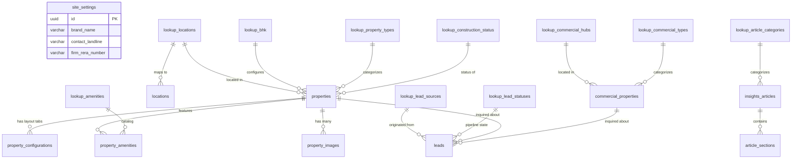

# Parmar Properties — Master Backend & Content Architecture Specification (`MASTER_BACKEND_SPEC.md`)

> **Repository Root Specification**  
> **Status:** Ready for Implementation  
> **Scope:** Complete Database Schema, CMS Fields, Lookup Catalogs, Lead Routing, RLS Security, and Frontend-to-Backend Mapping.  
> **Rule Compliance:** No code was modified in the preparation of this specification.

---

## Table of Contents
1. [Step 1: Complete Application Crawl (Routes, Components, Modals & Content)](#1-step-1-complete-application-crawl)
2. [Step 2: Baseline Verification & Gap Audit (Audit vs. Baseline)](#2-step-2-baseline-verification--gap-audit)
3. [Step 3 & 4: Normalized Database Architecture & Comprehensive Field Dictionaries](#3--4-database-architecture--field-dictionaries)
   - [A. Site Settings (`site_settings` — Singleton)](#a-site-settings-site_settings)
   - [B. Page Content (`page_content` — Per-Page Records)](#b-page-content-page_content)
   - [C. Core Collections (`properties`, `commercial_properties`, `locations`, `insights_articles`, `leads`, etc.)](#c-core-collections)
   - [D. Lookup Tables (No Hardcoded Option Lists)](#d-lookup-tables)
   - [E. Derived Values (Must NOT Be Stored in DB)](#e-derived-values)
4. [Step 5: Architectural Guarantees & Operational Rules](#5-step-5-architectural-guarantees--operational-rules)
   - [5.1 Duplicates & Conflict Resolution (Single Source of Truth)](#51-duplicates--conflict-resolution)
   - [5.2 Standard Fields on Every Collection](#52-standard-fields-on-every-collection)
   - [5.3 Media Uploads & Image Dimensions Matrix](#53-media-uploads--image-dimensions-matrix)
   - [5.4 Entity Relationship Diagram (ERD)](#54-entity-relationship-diagram-erd)
   - [5.5 Security & Row Level Security (RLS) Matrix](#55-security--row-level-security-rls-matrix)
5. [Step 6: Coverage Matrix & Open Questions](#6-step-6-coverage-matrix--open-questions)
   - [6.1 Full Coverage Matrix](#61-full-coverage-matrix)
   - [6.2 Open Architectural & Business Questions](#62-open-architectural--business-questions)

---

## 1. Step 1: Complete Application Crawl

Below is the exhaustive inventory of all 11 routes, 6 lead/inquiry modals and forms, layout systems, and interactive UI states crawled directly from `Frontend/app` and `Frontend/components`.

### 1.1 Route & View Inventory

| Route Path | Route Type | Primary Components Involved | Description & Dynamic Content |
| :--- | :--- | :--- | :--- |
| `/` | Static / SSR | `HeroCarousel.tsx`, `PropertyCard.tsx`, `PrivateOpportunities.tsx`, `WhyParmar.tsx`, `MarketIntelligenceSection.tsx` | Home page: Hero slides, live search console, featured properties grid (6), explore by location (4 cards + future strip), why metrics/pillars, insights preview. |
| `/properties?tab=buy` | Query SSR | `properties/page.tsx`, `PropertyCard.tsx`, `CompareBar.tsx` | Buy portfolio: All residential properties, dual-thumb budget slider (₹10–60+ Cr), locality, BHK, status, amenity filters, sort options. |
| `/properties?tab=new-launches`| Query SSR | `properties/page.tsx`, `PropertyCard.tsx` | New launches & pre-launch EOI window: Filtered by `isNewLaunch = true`, launch phases, investor milestone highlights. |
| `/properties?tab=luxury-collection`| Query SSR | `properties/page.tsx`, `PropertyCard.tsx` | Ultra-luxury collection: Filtered by `isLuxuryCollection = true` (or price &ge; ₹25 Cr), trophy asset standards, private client advisory alert. |
| `/properties/[slug]` | Dynamic SSR | `properties/[slug]/page.tsx`, `PropertyDetailClient.tsx`, `PropertyCard.tsx` | Single property dossier: Photo gallery lightbox, architectural floor plan tabs (master/floor/individual) with 4 layout variants (2, 3, 4, 5 BHK), specs, RERA QR, lead gate modal, direct inquiry form, similar listings. |
| `/commercials` | Static / SSR | `commercials/page.tsx`, `PrivateOpportunities.tsx` | Commercial assets: Grade-A offices, corporate HQs, retail flagships, commercial hubs filter, dual-thumb capital slider (₹15–65+ Cr), dossier inquiry modal. |
| `/locations` | Static / SSR | `locations/page.tsx`, `PropertyCard.tsx` | Micro-market directory: 9 active locations directory, tabs, upcoming pipeline cards with EOI actions, links to detail pages. |
| `/locations/[slug]` | Dynamic SSR | `locations/[slug]/page.tsx`, `PropertyCard.tsx` | Micro-market deep-dive: Cover banner, average rate/sq.ft, price band, lifestyle highlights, key enclaves tags, active property listings in this location. |
| `/market-intelligence` | Static / SSR | `market-intelligence/page.tsx` | Research hub: Articles categorized into Location, Price, Buyer Guide, NRI Guide, read times, summary points. |
| `/market-intelligence/[slug]`| Dynamic SSR | `market-intelligence/[slug]/page.tsx` | Editorial report: Executive takeaways box, structured body sections, data comparison tables, pull-quotes, author card, copy-link CTA, advisory consultation modal, related articles. |
| `/about` | Static / SSR | `about/page.tsx` | Heritage & story: 40+ years narrative, founder profile (Vikram Parmar), 4 trust metrics, 3 core pillars, advisory CTA box. |
| `/compare` | Client State | `compare/page.tsx` | Side-by-side comparison matrix (up to 4 properties): Price, carpet area, carpet rate/sq.ft, BHK, location, possession, floor, RERA ID, amenities; empty state. |
| `/saved` | Client/Auth | `saved/page.tsx`, `PropertyCard.tsx`, `CompareBar.tsx` | Client portfolio bookmarks: Auth gate prompt ("Client Authentication Required"), authenticated client bar, bookmarked cards, empty state. |
| `/contact` | Redirect | `contact/page.tsx` | Currently redirects to `/` via Next.js `redirect('/')`. Direct inquiries handled via advisory modals and footer. |
| Layout: Header | Global | `Navbar.tsx` | Logo, top nav links, mobile drawer, active indicator, "TALK TO OUR ADVISORY" button & modal. |
| Layout: Footer | Global | `Footer.tsx` | Brand title, EST badge, official website link, MahaRERA firm badge, 3-column navigation, office address, phone, email, copyright. |
| Global UI | Floating | `CompareBar.tsx`, `ScrollProgressBar.tsx` | Floating comparison dock (triggers on &ge; 1 property added to compare), page scroll progress bar. |

---

### 1.2 Modal & Form Inventory

Every interactive lead-capture form and modal in the application requires a persistent backend destination:

| Form / Modal Name | Trigger Location | Fields Captured | Target Database Table | Client Feedback / Next Step |
| :--- | :--- | :--- | :--- | :--- |
| **1. Navbar Advisory Modal** | Navbar "TALK TO OUR ADVISORY" button (Desktop & Mobile) | `name`, `phone`, `email`, `assetType` (Dropdown), `message` (Textarea) | `leads` (source: `navbar_advisory`) | Shows confirmation screen: "Consultation Scheduled" with senior director call notice. |
| **2. Home Private Opportunities Gate** | Home page `/` Private Opportunities section | Step 1: `phone`<br>Step 2: `otpCode`<br>Step 3: `fullName`, `email`, `propertyReference` | `leads` (source: `private_opportunities_otp`) | Sets verified lead in `localStorage` (`parmar_verified_lead`), unlocks confidential dossier. |
| **3. Property Detail Gated Lead Modal** | Clicking "View Floor Plan", "Download Brochure", "View Coordinates", or "Schedule Viewing" on `/properties/[slug]` | `name`, `phone`, `email`, `gateType` (`map`, `floorplan`, `brochure`, `viewing`, `price-breakdown`) | `leads` (source: `property_gate_modal`) | Unlocks protected content, auto-populates visitor profile in `localStorage`. |
| **4. Property Detail Direct Inquiry Form** | Right sticky sidebar on `/properties/[slug]` | `name`, `phone`, `email`, `message` (pre-filled with property title and price) | `leads` (source: `property_sidebar_inquiry`) | Shows success badge: "Advisory Request Received". |
| **5. Commercial Acquisition Dossier Modal** | Clicking "INQUIRE COMMERCIAL" on `/commercials` card | `company_or_name`, `phone`, `property_id` / `property_title` | `leads` (source: `commercial_card_modal`) | Browser alert/modal acknowledgement; alerts commercial desk. |
| **6. Market Intelligence Consultation Modal** | "Require specific portfolio evaluation on this topic?" on `/market-intelligence/[slug]` | `name`, `phone`, `email`, `budget` (Dropdown), `note` (Textarea), `article_id` | `leads` (source: `article_consultation_modal`) | Shows confirmation screen: "Advisory Request Received within 2 business hours". |

---

## 2. Step 2: Baseline Verification & Gap Audit

We verified every single field from `BACKEND_CONTENT_ATTRIBUTES_SPECIFICATION.md` against the active TypeScript codebase (`Frontend/data`, `Frontend/data/content`, and `Frontend/components`).

### 2.1 Baseline Field Verification Table

| Baseline Field / Group | Code Verification Result | Notes & Audit Findings |
| :--- | :--- | :--- |
| `brandName`, `estYearBadge` | **Confirmed** | Present in `common.content.ts`, `Footer.tsx`, and `Navbar.tsx`. |
| `contactPhone`, `officeAddress`, `firmReraNumber` | **Confirmed** | Present in `common.content.ts` and `Footer.tsx` (`+91 (022) 6666 9733`, `A51900018442`). |
| `hero.slides`, `hero.slideDurationMs` | **Confirmed** | Defined in `lib/constants.ts` (`HERO_SLIDES`, `SLIDE_DURATION_MS = 5000`). |
| `search.locationOptions`, `bhkOptions`, `statusOptions` | **Confirmed & Enhanced** | Code in `HeroCarousel.tsx` uses structured tuples `{ label, val, tab }`. |
| `featured.propertyIds`, `featured.maxCount` | **Confirmed** | Implemented via `PROPERTIES.slice(0, maxCount)` in `app/page.tsx`. |
| `locations.primaryCards`, `futureEnclaves` | **Confirmed** | Implemented in `home.content.ts` and `app/page.tsx` (Sewri, Powai, Prabhadevi, Lower Parel, Cuffe Parade). |
| `why.metrics`, `why.pillars` | **Confirmed** | Implemented in `WhyParmar.tsx` with animated cards and trust counters. |
| `buy.minBudgetDefault`, `buy.maxBudgetDefault` | **Confirmed** | Dynamic 2-way dual slider in `properties/page.tsx` (range ₹10–₹60 Cr+). |
| `newLaunches.showEoiBanner` | **Confirmed** | Controlled by `NEW_LAUNCHES_CONTENT` in `new-launches.content.ts`. |
| `luxury.minPriceFilter` (₹25 Cr+) | **Confirmed** | Threshold enforced in `properties/page.tsx` and `luxury-collection.content.ts`. |
| `commercials.hubs`, `commercials.minPrice`, `maxPrice` | **Confirmed** | Handled in `commercials/page.tsx` with 6 corporate hubs and dual slider (₹15–₹65 Cr+). |
| `locations` table schema | **Confirmed** | Matches `LOCATION_DATA` in `locations/[slug]/page.tsx`. |
| `insights_articles` schema | **Confirmed** | Matches `INSIGHTS_ARTICLES` in `insights.ts` including author, key takeaways, and tables. |
| `contact.desks` (3 departmental desks) | **Not Found / Divergent** | `app/contact/page.tsx` redirects to `/`. Contact desks are currently managed in `Navbar.tsx` and `Footer.tsx`. Baseline had static desks. |

### 2.2 What the Baseline Missed (Gaps Identified)

1. **Missing Routes & Pages:**
   - **`/compare` Page:** Missing entirely from the baseline. Contains comparison table headers, specification label translations, empty states, and limits (max 4).
   - **`/saved` Page:** Missing entirely from the baseline. Contains authentication gate copy, guest user session notice, and saved portfolio layout.
   - **Dynamic Route `/properties/[slug]` Detail Specs:** Baseline omitted the architectural floor plans tab system (`master` vs `floor` vs `individual`), the 4 layout variants (2, 3, 4, 5 BHK with areas, towers, and prices), and the lead gate context modal.
   - **Dynamic Route `/locations/[slug]` Detail Specs:** Baseline only considered the directory card, missing the single micro-market dossier content (infrastructure overview, rate bands, lifestyle highlights, and sub-enclaves).
2. **Missing Modals & Interactive Lead Flows:**
   - The baseline did not document the **6 discrete lead capture channels** (Navbar Advisory, OTP Gate, Property Gate, Sidebar Form, Commercial Card Modal, and Article Consultation Modal).
3. **Hardcoded Option Lists vs. Relational Normalization:**
   - Baseline stored options as hardcoded array strings (`['Worli', 'Bandra West']`). Step 3D requires **normalized lookup tables** so the admin can add/edit locations, BHKs, and statuses dynamically without code deployments.
4. **Derived vs. Stored Fields:**
   - Baseline proposed storing `priceFormatted` and `pricePerSqFt`. In a normalized PostgreSQL schema, these are strictly derived (see Section 3E).

---

## 3 & 4. Database Architecture & Field Dictionaries

### A. Site Settings (`site_settings`)

A singleton row (`id = 1`) storing global corporate credentials, contact endpoints, and layout configuration.

| Field Name | DB Column | Postgres Type | Nullable | Admin UI Control | Validation / Constraints | Default Value | Used in Component / File |
| :--- | :--- | :--- | :--- | :--- | :--- | :--- | :--- |
| Brand Name | `brand_name` | `VARCHAR(100)` | No | Text | Max 100 chars | `'PARMAR PROPERTIES'` | `Navbar.tsx`, `Footer.tsx` |
| Established Year | `est_year` | `SMALLINT` | No | Number | 1900 to Current Year | `1981` | `Footer.tsx`, `AboutPage.tsx` |
| Established Badge | `est_badge` | `VARCHAR(30)` | No | Text | Max 30 chars | `'EST. 1981'` | `Footer.tsx`, `WhyParmar.tsx` |
| Sub-Brand Tagline | `brand_tagline` | `VARCHAR(200)` | No | Text | Max 200 chars | `'Mumbai • Prime Residential Real Estate'` | `Navbar.tsx`, `Footer.tsx` |
| Primary Landline | `contact_landline` | `VARCHAR(30)` | No | Text (Phone) | Formatted string | `'+91 (022) 6666 9733'` | `Footer.tsx`, `common.content.ts`|
| Primary Mobile | `contact_mobile` | `VARCHAR(30)` | Yes | Text (Phone) | Formatted string | `'+91 98200 12345'` | `Navbar.tsx`, `Contact` |
| WhatsApp Digits | `whatsapp_number` | `VARCHAR(20)` | No | Text (Digits) | Regex `^[0-9]{10,15}$` | `'919820012345'` | Global floating WhatsApp |
| Primary Support Email | `contact_email` | `VARCHAR(120)` | No | Text (Email) | Valid email format | `'contact@parmarproperties.com'` | `Footer.tsx`, `Navbar.tsx` |
| Advisory Desk Email | `advisory_email` | `VARCHAR(120)` | No | Text (Email) | Valid email format | `'advisory@parmarproperties.com'` | `Navbar.tsx`, `enquire/route.ts` |
| Office Building | `office_building` | `VARCHAR(150)` | No | Text | Max 150 chars | `'Peninsula Center, 208'` | `Footer.tsx` |
| Office Street | `office_street` | `VARCHAR(150)` | No | Text | Max 150 chars | `'Doctor SS Rao Marg, Parel'` | `Footer.tsx` |
| Office City State Pin | `office_city_pin` | `VARCHAR(100)` | No | Text | Max 100 chars | `'Mumbai, Maharashtra 400012'`| `Footer.tsx` |
| Working Hours | `working_hours` | `VARCHAR(100)` | No | Text | Max 100 chars | `'Mon - Sun: 10:00 AM - 6:30 PM IST'` | `Footer.tsx` |
| MahaRERA Firm Reg No | `firm_rera_number`| `VARCHAR(50)` | No | Text | Regex `^[A-Z0-9]{8,16}$` | `'A51900018442'` | `Footer.tsx`, `Navbar.tsx` |
| Official Website URL | `official_website`| `VARCHAR(255)` | No | Text (URL) | Valid URL format | `'https://www.parmarproperties.in/'` | `Footer.tsx` |
| Navbar Advisory Label | `nav_cta_label` | `VARCHAR(50)` | No | Text | Max 50 chars | `'TALK TO OUR ADVISORY'` | `Navbar.tsx` |
| Global Meta Title | `meta_title` | `VARCHAR(100)` | No | Text | 50–70 chars | `'Parmar Properties \| Luxury Real Estate Mumbai'` | `app/layout.tsx` |
| Global Meta Description| `meta_desc` | `VARCHAR(255)` | No | Textarea | 140–160 chars | `'Curated portfolio of prime waterfront residences across Mumbai.'` | `app/layout.tsx` |
| Social Links | `social_links` | `JSONB` | No | Key-Value / JSON | `{ linkedin, instagram, x }` | `{"linkedin":"","instagram":""}` | `Footer.tsx` |

---

### B. Page Content (`page_content`)

One record per route containing editorial copy, section headings, badges, and layout parameters.

#### Schema Structure: `page_content`
* `id` (`VARCHAR(50)` PRIMARY KEY, e.g. `'home'`, `'buy'`, `'new-launches'`, `'luxury-collection'`, `'commercials'`, `'locations'`, `'insights'`, `'about'`, `'compare'`, `'saved'`)
* `title` (`VARCHAR(150)` NOT NULL)
* `subtitle` (`TEXT`)
* `breadcrumb` (`VARCHAR(100)`)
* `badge` (`VARCHAR(80)`)
* `meta_title` (`VARCHAR(120)` NOT NULL)
* `meta_description` (`VARCHAR(255)` NOT NULL)
* `sections_data` (`JSONB` NOT NULL DEFAULT `'{}'::jsonb`)
* `updated_at` (`TIMESTAMPTZ` NOT NULL DEFAULT `now()`)

#### B.1 Home Page (`id = 'home'`) in `sections_data`:
* **Hero Section:**
  * `hero_headline` (`VARCHAR(100)`): `'MUMBAI\'S FINEST ADDRESSES'`
  * `hero_subtext` (`TEXT`): `'Curated residences, private oppurtunities and investment properties across Mumbai\'s most sought after neighbourhoods'`
  * `hero_slide_duration_ms` (`INTEGER`): `5000`
* **Search Console Limits:**
  * `search_min_budget_cr` (`NUMERIC(4,1)`): `3.0`
  * `search_max_budget_cr` (`NUMERIC(4,1)`): `60.0`
* **Featured Showcase:**
  * `featured_heading` (`VARCHAR(100)`): `'FEATURED PROPERTIES'`
  * `featured_subheading` (`TEXT`): `'Hand-curated prime residences across Mumbai’s most coveted enclaves.'`
  * `featured_max_count` (`INTEGER`): `6`
* **Location Showcase:**
  * `location_tag` (`VARCHAR(50)`): `'FILTERED BY LOCATION'`
  * `location_heading` (`VARCHAR(100)`): `'EXPLORE PROPERTIES'`
  * `location_subheading` (`TEXT`): `'Explore Mumbai’s premier residential micro-markets...'`
  * `future_locations_label` (`VARCHAR(50)`): `'FUTURE LOCATIONS :'`
* **Why Parmar Section:**
  * `why_badge` (`VARCHAR(80)`): `'ESTABLISHED 1981 • FOUR DECADES OF EXCELLENCE'`
  * `why_title_prefix` (`VARCHAR(50)`): `'WHY'`
  * `why_title_highlight` (`VARCHAR(80)`): `'PARMAR PROPERTIES'`
  * `why_subtitle` (`TEXT`): Bespoke advisory description.
  * `why_trust_metrics` (`JSONB Array`): 4 items (`[{ value: "40+", label: "Market Leadership", sub: "Generational Expertise" }, ...]`)
  * `why_pillars` (`JSONB Array`): 4 items (`[{ number: "01", title: "Generational Trust", description: "...", badge: "Heritage" }, ...]`)
* **Private Opportunities Banner:**
  * `private_badge` (`VARCHAR(50)`): `'OFF-MARKET & CONFIDENTIAL'`
  * `private_heading` (`VARCHAR(100)`): `'PRIVATE OPPORTUNITIES'`
  * `private_paragraphs` (`JSONB Array`): Explanatory texts for off-market mandates.
  * `private_cta_text` (`VARCHAR(50)`): `'REQUEST PRIVATE ACCESS'`
  * `private_disclaimer` (`VARCHAR(100)`): `'Verified HNIs, Family Offices & Principals Only'`

#### B.2 Buy Portfolio (`id = 'buy'`) in `sections_data`:
* `header_title`: `'Buy Mumbai Residences'`
* `header_subtitle`: `'Explore the complete portfolio of hand-selected, verified ready-to-move and under-construction residences...'`
* `budget_default_min`: `10.0`
* `budget_default_max`: `60.0`
* `empty_heading`: `'No Residences Match Your Exact Filter Criteria'`
* `empty_reset_btn`: `'RESET ALL FILTERS'`

#### B.3 New Launches (`id = 'new-launches'`) in `sections_data`:
* `header_title`: `'New Launches & Pre-Launch'`
* `header_subtitle`: `'Upcoming landmark towers, pre-launch Expression of Interest (EOI) phases...'`
* `show_eoi_banner`: `true`
* `eoi_banner_title`: `'Pre-Launch EOI Window Open:'`
* `eoi_banner_subtitle`: `'Priority floor allocation, launch phase payment flexibilities & MahaRERA approved milestones.'`
* `investor_highlights`: `[{ title: "Pre-Launch Price Advantage", description: "..." }, { title: "Construction Milestones", description: "..." }, { title: "Priority Floor Selection", description: "..." }]`

#### B.4 Luxury Collection (`id = 'luxury-collection'`) in `sections_data`:
* `header_title`: `'The Luxury Collection'`
* `header_subtitle`: `'Publicly viewable signature trophy assets: oceanfront sky villas, sprawling penthouses...'`
* `min_price_threshold`: `25.0`
* `curation_standards`: `[{ title: "Waterfront Horizons", desc: "..." }, { title: "Private Access", desc: "..." }, { title: "Generational Scale", desc: "..." }, { title: "Diplomatic Security", desc: "..." }]`

#### B.5 Commercials (`id = 'commercials'`) in `sections_data`:
* `header_title`: `'COMMERCIAL REAL ESTATE'`
* `header_subtitle`: `'Grade-A corporate headquarters, boutique office suites, and pre-leased assets...'`
* `budget_slider_min`: `15.0`
* `budget_slider_max`: `65.0`
* `dossier_modal_title`: `'Commercial Acquisition Desk'`
* `dossier_modal_subtitle`: `'Receive detailed lease schedules, capital cap rates & architectural floor plans.'`

#### B.6 Locations Hub (`id = 'locations'`) in `sections_data`:
* `header_title`: `'Explore Properties by Location'`
* `header_subtitle`: `'Explore Mumbai’s premier residential micro-markets...'`
* `upcoming_pipeline_title`: `'Upcoming Location Pipeline'`
* `upcoming_pipeline_subtitle`: `'Sewri • Powai • Prabhadevi • Pre-Launch Pipeline'`

#### B.7 Market Intelligence Hub (`id = 'insights'`) in `sections_data`:
* `badge`: `'RESEARCH & ADVISORY DESK'`
* `header_title`: `'MARKET INTELLIGENCE'`
* `header_subtitle`: `'Data-backed insights, micro-market pricing analyses, and legal guidance for Mumbai real estate acquisitions.'`

#### B.8 About Us (`id = 'about'`) in `sections_data`:
* `header_badge`: `'Our Heritage • Active Since 1981'`
* `header_title`: `'Parmar Properties'`
* `story_heading`: `'A Legacy of Discretion & Architectural Integrity'`
* `story_paragraphs`: `["Founded in Mumbai...", "From the iconic coastal towers..."]`
* `founder_name`: `'Vikram Parmar'`
* `founder_title`: `'Founder & Principal Managing Director'`
* `founder_initials`: `'VP'`
* `metrics`: `[{ value: "₹5,000+ Cr", label: "Transacted Portfolio", sub: "Discreet advisory volume" }, ...]`
* `pillars`: `[{ title: "Generational Trust", description: "..." }, ...]`

#### B.9 Compare Page (`id = 'compare'`) in `sections_data`:
* `max_compare_limit`: `4`
* `header_title`: `'Compare Residences'`
* `empty_heading`: `'No Residences Added to Comparison'`
* `empty_subtext`: `'Select up to 4 properties from our portfolio to view a detailed side-by-side analysis.'`

#### B.10 Saved Residences (`id = 'saved'`) in `sections_data`:
* `header_title`: `'Saved Residences'`
* `auth_prompt_heading`: `'Client Authentication Required'`
* `auth_prompt_desc`: `'Your saved properties portfolio is secured. Sign in with your client profile to access and manage your curated Mumbai residences.'`

---

### C. Core Collections

#### C.1 `properties` (Residential Catalog)

| Field Name | DB Column | Postgres Type | Nullable | Admin UI Control | Validation / Constraints | Default Value | Used in Component / File |
| :--- | :--- | :--- | :--- | :--- | :--- | :--- | :--- |
| Primary Key | `id` | `UUID` | No | Read-Only | Primary Key | `gen_random_uuid()` | All property routes |
| URL Slug | `slug` | `VARCHAR(120)` | No | Text (Slug) | Unique, lowercase, hyphenated | None | Routing `/properties/[slug]` |
| Title | `title` | `VARCHAR(150)` | No | Text | Max 150 chars | None | `PropertyCard.tsx`, Detail |
| Tagline | `tagline` | `VARCHAR(200)` | No | Text | Max 200 chars | None | `PropertyCard.tsx`, Detail |
| Location FK | `location_id` | `UUID` | No | Dropdown (FK) | References `lookup_locations(id)` | None | Filter matching |
| Sub-Location Details| `sub_location` | `VARCHAR(150)` | No | Text | e.g. `'Worli Sea Face, South Mumbai'` | None | `PropertyCard.tsx`, Detail |
| Price (in ₹ Cr) | `price` | `NUMERIC(6,2)` | No | Number (Decimal)| Greater than 0.00 | None | Range slider filtering |
| BHK Config FK | `bhk_id` | `UUID` | No | Dropdown (FK) | References `lookup_bhk(id)` | None | BHK filtering |
| Carpet Area (sq.ft) | `carpet_area` | `INTEGER` | No | Number (Int) | Greater than 0 | None | Card specs & sorting |
| Super Area (sq.ft) | `super_area` | `INTEGER` | Yes | Number (Int) | Greater than `carpet_area` | None | Detail specs |
| Property Type FK | `property_type_id`| `UUID` | No | Dropdown (FK) | References `lookup_property_types(id)`| None | Type badge & filtering |
| Construction Status FK| `status_id` | `UUID` | No | Dropdown (FK) | References `lookup_construction_status(id)`| None| Status dropdown |
| Possession Date Text| `possession_date` | `VARCHAR(50)` | No | Text | e.g. `'Ready to Move'`, `'Q4 2027'` | None | `PropertyCard.tsx`, Detail |
| Floor Information | `floor` | `VARCHAR(80)` | No | Text | e.g. `'42nd Floor of 58'` | None | Card specs, detail |
| Featured on Home | `is_featured` | `BOOLEAN` | No | Checkbox | Toggle | `false` | Shows in top 6 on `/` |
| Featured Order | `featured_order` | `SMALLINT` | Yes | Number (Int) | 1 to 12 | `NULL` | Ordering on home page |
| Recently Added Badge| `recently_added` | `BOOLEAN` | No | Checkbox | Toggle | `false` | Sort priority |
| Recommended Pick | `is_recommended` | `BOOLEAN` | No | Checkbox | Toggle | `false` | Editorial badge |
| Is New Launch | `is_new_launch` | `BOOLEAN` | No | Checkbox | Toggle | `false` | Controls tab placement |
| Launch Phase FK | `launch_phase_id` | `UUID` | Yes | Dropdown (FK) | Pre-Launch, Under Construction | `NULL` | Badge on cards |
| Cover Image Path | `cover_image` | `TEXT` | No | Media Upload | Valid URL / Storage Path | None | Card & Hero thumbnail |
| MahaRERA Number | `rera_id` | `VARCHAR(50)` | No | Text | Format `P51...` | None | Card & Detail compliance |
| MahaRERA QR Code | `rera_qr_image` | `TEXT` | Yes | Media Upload | Image path | `NULL` | Detail page QR modal |
| Latitude | `latitude` | `NUMERIC(10,7)`| Yes | Number (Float) | Valid coordinates | `NULL` | Protected map gate |
| Longitude | `longitude` | `NUMERIC(10,7)`| Yes | Number (Float) | Valid coordinates | `NULL` | Protected map gate |
| Brochure PDF URL | `brochure_path` | `TEXT` | Yes | Media Upload | Storage PDF path | `NULL` | Protected brochure gate |
| Full Description | `description` | `TEXT` | No | Rich Text | Detailed editorial copy | None | Property Detail |
| Key Highlights | `highlights` | `TEXT[]` | No | Tag Input | 3 to 5 bullet points | `'{}'` | Detail bullet list |
| Publication Status | `status` | `VARCHAR(20)` | No | Dropdown | `'draft'`, `'published'`, `'archived'` | `'published'` | RLS filter |
| Display Sort Order | `sort_order` | `INTEGER` | No | Number (Int) | Display rank | `0` | Default catalog ordering |
| Created At | `created_at` | `TIMESTAMPTZ` | No | Read-Only | Auto timestamp | `now()` | Audit trail |
| Updated At | `updated_at` | `TIMESTAMPTZ` | No | Read-Only | Auto timestamp | `now()` | Audit trail |

#### C.2 `property_images` (Gallery)
* `id` (`UUID` PRIMARY KEY DEFAULT `gen_random_uuid()`)
* `property_id` (`UUID` NOT NULL REFERENCES `properties(id)` ON DELETE CASCADE)
* `image_path` (`TEXT` NOT NULL)
* `image_url` (`TEXT` NOT NULL)
* `alt_text` (`VARCHAR(200)` NOT NULL)
* `is_primary` (`BOOLEAN` NOT NULL DEFAULT `false`)
* `display_order` (`INTEGER` NOT NULL DEFAULT `0`)
* `created_at` (`TIMESTAMPTZ` NOT NULL DEFAULT `now()`)

#### C.3 `property_configurations` (Floor Plans & Variants)
Represents the 4 architectural layout tabs (`2bhk`, `3bhk`, `4bhk`, `5bhk`) on `/properties/[slug]`:
* `id` (`UUID` PRIMARY KEY DEFAULT `gen_random_uuid()`)
* `property_id` (`UUID` NOT NULL REFERENCES `properties(id)` ON DELETE CASCADE)
* `plan_type` (`VARCHAR(30)` NOT NULL CHECK (`plan_type` IN ('master', 'floor', 'individual')))
* `variant_code` (`VARCHAR(20)` NOT NULL CHECK (`variant_code` IN ('2bhk', '3bhk', '4bhk', '5bhk', 'custom')))
* `tab_label` (`VARCHAR(30)` NOT NULL, e.g. `'3 BHK'`)
* `title` (`VARCHAR(100)` NOT NULL, e.g. `'3 BHK Sky Residence'`)
* `area_range` (`VARCHAR(60)` NOT NULL, e.g. `'1,450 – 1,820 sq.ft'`)
* `carpet_area` (`VARCHAR(50)` NOT NULL, e.g. `'1,820 Sq.Ft'`)
* `price_indicator` (`VARCHAR(60)` NOT NULL, e.g. `'₹7.80 Cr – ₹9.20 Cr'`)
* `tower_zone` (`VARCHAR(100)` NOT NULL, e.g. `'High-Rise Sky Suites (Levels 22–48)'`)
* `image_path` (`TEXT` NOT NULL)
* `display_order` (`INTEGER` NOT NULL DEFAULT `0`)

#### C.4 `property_amenities` (Many-to-Many Bridge)
* `property_id` (`UUID` NOT NULL REFERENCES `properties(id)` ON DELETE CASCADE)
* `amenity_id` (`UUID` NOT NULL REFERENCES `lookup_amenities(id)` ON DELETE CASCADE)
* `display_order` (`INTEGER` NOT NULL DEFAULT `0`)
* PRIMARY KEY (`property_id`, `amenity_id`)

#### C.5 `commercial_properties` (Commercial Catalog)

| Field Name | DB Column | Postgres Type | Nullable | Admin UI Control | Validation / Constraints | Default Value | Used in Component / File |
| :--- | :--- | :--- | :--- | :--- | :--- | :--- | :--- |
| Primary Key | `id` | `UUID` | No | Read-Only | Primary Key | `gen_random_uuid()` | Commercial routes |
| URL Slug | `slug` | `VARCHAR(120)` | No | Text (Slug) | Unique, lowercase | None | Direct dossier links |
| Title | `title` | `VARCHAR(150)` | No | Text | Max 150 chars | None | `commercials/page.tsx` |
| Tagline | `tagline` | `VARCHAR(200)` | No | Text | Max 200 chars | None | `commercials/page.tsx` |
| Commercial Hub FK | `hub_id` | `UUID` | No | Dropdown (FK) | References `lookup_commercial_hubs(id)`| None| Hub filtering (BKC, Lower Parel) |
| Sub-Location | `sub_location` | `VARCHAR(150)` | No | Text | e.g. `'G Block, Bandra Kurla Complex'` | None | Card details |
| Price (in ₹ Cr) | `price` | `NUMERIC(6,2)` | No | Number (Decimal)| Greater than 0.00 | None | Capital budget slider |
| Carpet Area (sq.ft) | `carpet_area` | `INTEGER` | No | Number (Int) | Greater than 0 | None | Card specs & sorting |
| Commercial Type FK | `commercial_type_id`| `UUID` | No | Dropdown (FK) | Grade-A, Corporate HQ, Retail | None | Filter & badges |
| Floor Plate Details | `floor` | `VARCHAR(80)` | No | Text | e.g. `'14th Floor Single Plate'` | None | Card specifications |
| Possession Status | `possession` | `VARCHAR(50)` | No | Dropdown | `'Ready to Move'`, `'Immediate'` | None | Card specifications |
| Commercial Grade FK | `grade_id` | `UUID` | No | Dropdown (FK) | Grade-A+, LEED Platinum | None | Card badge |
| Cover Image | `cover_image` | `TEXT` | No | Media Upload | Valid URL / storage path | None | Card image |
| MahaRERA Number | `rera_id` | `VARCHAR(50)` | No | Text | Format `P51...` | None | RERA compliance line |
| Full Description | `description` | `TEXT` | No | Rich Text | Overview | None | Acquisition Dossier |
| Highlights | `highlights` | `TEXT[]` | No | Tag Input | 3 bullet points | `'{}'` | Dossier specs |
| Publication Status | `status` | `VARCHAR(20)` | No | Dropdown | `'draft'`, `'published'`, `'archived'` | `'published'` | RLS filter |
| Display Sort Order | `sort_order` | `INTEGER` | No | Number (Int) | Display rank | `0` | Ordering |
| Created / Updated At| `created_at`, `updated_at` | `TIMESTAMPTZ` | No | Read-Only | Auto timestamp | `now()` | Audit trail |

#### C.6 `locations` (Micro-Markets & Future Enclaves)

| Field Name | DB Column | Postgres Type | Nullable | Admin UI Control | Validation / Constraints | Default Value | Used in Component / File |
| :--- | :--- | :--- | :--- | :--- | :--- | :--- | :--- |
| Primary Key | `id` | `UUID` | No | Read-Only | Primary Key | `gen_random_uuid()` | Location routes |
| Name | `name` | `VARCHAR(80)` | No | Text | e.g. `'Worli'`, `'Sewri'` | None | All location cards & menus |
| URL Slug | `slug` | `VARCHAR(80)` | No | Text (Slug) | Unique, lowercase | None | Route `/locations/[slug]` |
| Tagline | `tagline` | `VARCHAR(150)` | No | Text | Max 150 chars | None | Location header |
| Editorial Overview | `description` | `TEXT` | No | Textarea | Architectural & lifestyle overview | None | Detail `/locations/[slug]` |
| Cover Image Path | `cover_image` | `TEXT` | No | Media Upload | 1920×1080px WebP | None | Banner on detail page |
| Price Band Text | `price_range` | `VARCHAR(50)` | No | Text | e.g. `'₹18 Cr - ₹75 Cr+'` | None | Detail metrics |
| Average Capital Rate| `average_rate` | `VARCHAR(60)` | No | Text | e.g. `'₹65,000 - ₹1,20,000 / sq.ft'` | None | Directory card & detail |
| Lifestyle Tags Text | `lifestyle` | `VARCHAR(200)` | No | Text | e.g. `'Sea Link Promenade, High-Rise'` | None | Detail highlights |
| Key Enclaves List | `key_enclaves` | `TEXT[]` | No | Tag Input | e.g. `['Worli Sea Face', 'Pochkhanawala']` | `'{}'` | Detail street tags |
| Primary 4 on Home | `is_primary_home`| `BOOLEAN` | No | Checkbox | Toggle (Max 4 active) | `false` | Top 4 cards on `/` |
| Primary Home Order | `primary_order` | `SMALLINT` | Yes | Number (Int) | 1 to 4 | `NULL` | Card order on `/` |
| Is Future Enclave | `is_future` | `BOOLEAN` | No | Checkbox | Toggle | `false` | Future locations strip |
| Future Strip Order | `future_order` | `SMALLINT` | Yes | Number (Int) | Order on future bar | `NULL` | Sequence on `/` |
| Publication Status | `status` | `VARCHAR(20)` | No | Dropdown | `'draft'`, `'published'` | `'published'` | RLS filter |

#### C.7 `insights_articles` (Market Intelligence Reports)

| Field Name | DB Column | Postgres Type | Nullable | Admin UI Control | Validation / Constraints | Default Value | Used in Component / File |
| :--- | :--- | :--- | :--- | :--- | :--- | :--- | :--- |
| Primary Key | `id` | `UUID` | No | Read-Only | Primary Key | `gen_random_uuid()` | Routing & Relations |
| URL Slug | `slug` | `VARCHAR(120)` | No | Text (Slug) | Unique lowercase string | None | Route `/market-intelligence/[slug]`|
| Category Header | `category_header`| `VARCHAR(80)` | No | Text | e.g. `'WORLI PROPERTY GUIDE 2026'` | None | Card & Detail pill |
| Category FK | `category_id` | `UUID` | No | Dropdown (FK) | References `lookup_article_categories(id)`| None | Filter tabs (`location`, `price`, etc.) |
| Title | `title` | `VARCHAR(150)` | No | Text | Max 150 chars | None | Article header |
| Subtitle | `subtitle` | `VARCHAR(200)` | No | Text | Max 200 chars | None | Article subheader |
| Short Description | `description` | `TEXT` | No | Textarea | Max 250 chars | None | Preview card description |
| Estimated Read Time| `read_time` | `VARCHAR(20)` | No | Text | e.g. `'5 min read'` | None | Preview & Meta bar |
| Pill Tag | `tag` | `VARCHAR(50)` | No | Text | e.g. `'Price Analysis'` | None | Tag pill |
| Date Tag | `date_tag` | `VARCHAR(50)` | No | Text | e.g. `'Q1 2026 Benchmark'` | None | Meta bar |
| Cover / Card Image | `image_path` | `TEXT` | No | Media Upload | WebP image | None | Preview card image |
| Author Name | `author_name` | `VARCHAR(100)` | No | Text | e.g. `'Advisory Research Desk'` | None | Author card |
| Author Role | `author_role` | `VARCHAR(100)` | No | Text | e.g. `'Head of Prime Residential Valuation'`| None| Author card |
| Author Desk | `author_desk` | `VARCHAR(100)` | No | Text | e.g. `'Parmar Properties Research'` | None | Author card |
| Executive Takeaways| `key_takeaways` | `TEXT[]` | No | List of Strings | 3 to 5 strategic summary bullets | `'{}'` | Strategic Summary Box |
| Publication Status | `status` | `VARCHAR(20)` | No | Dropdown | `'draft'`, `'published'`, `'archived'` | `'published'` | RLS filter |
| Created / Updated At| `created_at`, `updated_at` | `TIMESTAMPTZ` | No | Read-Only | Auto timestamp | `now()` | Audit trail |

#### C.8 `article_sections` (Structured Content & Tables)
* `id` (`UUID` PRIMARY KEY DEFAULT `gen_random_uuid()`)
* `article_id` (`UUID` NOT NULL REFERENCES `insights_articles(id)` ON DELETE CASCADE)
* `section_order` (`INTEGER` NOT NULL DEFAULT `0`)
* `heading` (`VARCHAR(150)` NOT NULL)
* `paragraphs` (`TEXT[]` NOT NULL DEFAULT `'{}'`)
* `table_data` (`JSONB` NULL, e.g. `{"headers": ["Enclave", "Price"], "rows": [["Worli", "₹22 Cr"]]}`)
* `highlight_quote` (`TEXT` NULL)

#### C.9 `leads` (Consolidated Inquiries & CRM Table)

| Field Name | DB Column | Postgres Type | Nullable | Admin UI Control | Validation / Constraints | Default Value | Notes |
| :--- | :--- | :--- | :--- | :--- | :--- | :--- | :--- |
| Lead ID | `id` | `UUID` | No | Read-Only | Primary Key | `gen_random_uuid()` | Auto generated |
| Full Name | `full_name` | `VARCHAR(120)` | No | Text | Min 2 chars | None | Captured from form |
| Phone Number | `phone` | `VARCHAR(30)` | No | Text (Phone) | Min 10 digits | None | E.164 formatted |
| Email Address | `email` | `VARCHAR(120)` | Yes | Text (Email) | Valid email | `NULL` | Captured where requested |
| Company Name | `company_name` | `VARCHAR(120)` | Yes | Text | Max 120 chars | `NULL` | Commercial inquiries |
| Source Channel FK | `source_id` | `UUID` | No | Dropdown (FK) | References `lookup_lead_sources(id)` | None | Which modal/form sent this |
| Target Property ID | `property_id` | `UUID` | Yes | Dropdown (FK) | References `properties(id)` | `NULL` | Associated residential asset |
| Target Commercial ID| `commercial_id` | `UUID` | Yes | Dropdown (FK) | References `commercial_properties(id)`| `NULL` | Associated commercial asset |
| Target Article ID | `article_id` | `UUID` | Yes | Dropdown (FK) | References `insights_articles(id)` | `NULL` | Associated research report |
| Asset Class Indicated| `asset_class` | `VARCHAR(80)` | Yes | Dropdown | Residential, Pre-Launch, Commercial | `NULL` | From Navbar / Gate dropdown |
| Budget Indicated | `budget_range` | `VARCHAR(80)` | Yes | Text | e.g. `'₹15 Cr – ₹30 Cr'` | `NULL` | Indicated budget band |
| Message / Notes | `message` | `TEXT` | Yes | Textarea | Client requirements | `NULL` | Optional client note |
| Gate Type Unlocked | `gate_type` | `VARCHAR(50)` | Yes | Text | `'brochure'`, `'floorplan'`, `'map'`, `'viewing'`| `NULL` | For gated property actions |
| Verified via OTP | `is_otp_verified`| `BOOLEAN` | No | Read-Only | Boolean flag | `false` | True if OTP verified |
| Lead Status FK | `status_id` | `UUID` | No | Dropdown (FK) | References `lookup_lead_statuses(id)`| None | CRM pipeline workflow |
| Assigned Advisor | `assigned_to` | `UUID` | Yes | Dropdown (FK) | References `profiles(id)` | `NULL` | Internal advisor assigned |
| Created At | `created_at` | `TIMESTAMPTZ` | No | Read-Only | Auto timestamp | `now()` | Submission time |

---

### D. Lookup Tables

To guarantee that **no option lists are hardcoded**, the following lookup tables must be implemented. Each lookup table follows the standard structure: `id` (`UUID`), `slug` (`VARCHAR(80)` UNIQUE), `name` (`VARCHAR(100)`), `display_order` (`INTEGER`), `is_active` (`BOOLEAN`).

#### 1. `lookup_locations`
* `worli` &rarr; Worli
* `bandra-west` &rarr; Bandra West
* `juhu` &rarr; Juhu
* `malabar-hill` &rarr; Malabar Hill
* `lower-parel` &rarr; Lower Parel
* `prabhadevi` &rarr; Prabhadevi
* `powai` &rarr; Powai
* `sewri` &rarr; Sewri
* `cuffe-parade` &rarr; Cuffe Parade
* `bkc` &rarr; BKC
* `khar-west` &rarr; Khar West

#### 2. `lookup_bhk`
* `any` &rarr; Any Configuration
* `3-bhk` &rarr; 3 BHK
* `4-bhk` &rarr; 4 BHK
* `5-bhk` &rarr; 5 BHK
* `6-plus-bhk` &rarr; 6+ BHK / Penthouse

#### 3. `lookup_construction_status`
* `ready-to-move` &rarr; Ready to Move In (Maps to Buy tab)
* `under-construction` &rarr; Under Construction (Maps to New Launches tab)
* `pre-launch` &rarr; Pre-Launch (Maps to New Launches tab)
* `luxury-collection` &rarr; Luxury Collection (Maps to Luxury tab)
* `resale` &rarr; Resale (Maps to Buy tab)

#### 4. `lookup_property_types` (Residential)
* `sea-facing-apartment` &rarr; Sea-Facing Apartment
* `penthouse` &rarr; Penthouse
* `sky-villa` &rarr; Sky Villa
* `duplex` &rarr; Duplex
* `luxury-estate` &rarr; Luxury Estate

#### 5. `lookup_commercial_types` (Commercial)
* `grade-a-office` &rarr; Grade-A Office
* `corporate-hq` &rarr; Corporate HQ
* `high-street-retail` &rarr; High-Street Retail
* `commercial-penthouse`&rarr; Commercial Penthouse
* `boutique-office` &rarr; Boutique Office

#### 6. `lookup_amenities` (Catalog)
* `private-elevator` &rarr; Private Elevator
* `infinity-sky-pool` &rarr; Infinity Sky Pool
* `private-plunge-pool` &rarr; Private Plunge Pool
* `sea-facing-balconies`&rarr; Sea-Facing Balconies
* `automated-smart-home`&rarr; Automated Smart Home
* `concierge-valet` &rarr; Concierge & Valet
* `clubhouse-spa` &rarr; Clubhouse & Spa
* `ev-charging-bays` &rarr; EV Charging Bays
* `biometric-security` &rarr; 24/7 Biometric Security
* `private-wine-cellar` &rarr; Temperature Controlled Wine Cellar

#### 7. `lookup_article_categories` (Market Intelligence)
* `location` &rarr; Location Guides & Micro-Market Analysis
* `price` &rarr; Price Benchmarks & Capital Appreciation
* `buyer` &rarr; Buyer Advisory & Architecture
* `nri` &rarr; Cross-Border & NRI Regulatory Playbook

#### 8. `lookup_lead_sources`
* `navbar_advisory` &rarr; Navbar "Talk to Our Advisory" Modal
* `private_opportunities_otp` &rarr; Home Private Opportunities Gate
* `property_gate_modal` &rarr; Property Protected Resource Gate
* `property_sidebar_inquiry` &rarr; Property Detail Sidebar Form
* `commercial_card_modal` &rarr; Commercial Acquisition Dossier Modal
* `article_consultation_modal` &rarr; Market Intelligence Consultation Modal

#### 9. `lookup_lead_statuses` (CRM Workflow)
* `new` &rarr; New Inquiry Received
* `assigned` &rarr; Assigned to Senior Advisor
* `contacted` &rarr; Client Contacted
* `viewing_scheduled` &rarr; Site Viewing Scheduled
* `negotiation` &rarr; Term Sheet / Negotiation
* `closed_won` &rarr; Transaction Closed
* `disqualified` &rarr; Disqualified / Spam

---

### E. Derived Values (Must NOT Be Stored in DB)

The following values must be computed dynamically by the application layer or database SQL views, and **must not be persisted as separate database columns**:

1. **`priceFormatted`**:
   * *Formula:* If `price` &ge; 1.0, format as `'₹' + price.toFixed(2) + ' Cr'`. E.g. `price = 32.5` &rarr; `'₹32.50 Cr'`. If under 1 Cr, format in Lakhs.
   * *Reason:* Redundant storage risks pricing mismatch when an admin updates the numeric `price`.
2. **`pricePerSqFt` (in `/compare`):**
   * *Formula:* `Math.round((price * 10000000) / carpet_area)`. Formatted as `'₹' + rate.toLocaleString() + ' / sq.ft'`.
   * *Reason:* Direct mathematical function of `price` and `carpet_area`.
3. **Tab Counts (`buyCount`, `newLaunchesCount`, `luxuryCount`):**
   * *Formula:* SQL `COUNT(*)` grouped by publication status and category flags.
   * *Reason:* Must accurately reflect real-time active inventory.
4. **Estimated Read Time (`readTime`):**
   * *Formula:* Total words in `article_sections` divided by 200 words per minute.
   * *Reason:* Auto-calculated whenever article paragraphs are edited.
5. **Dynamic Filter Bounds (`minPrice`, `maxPrice`):**
   * *Formula:* `SELECT MIN(price), MAX(price) FROM properties WHERE status = 'published'`.

---

## 5. Step 5: Architectural Guarantees & Operational Rules

### 5.1 Duplicates & Conflict Resolution

During the crawl, multiple data points were found defined in more than one location. Below is the strict **Single Source of Truth** resolution:

| Field / Concept | Conflict / Duplicate Locations | Single Source of Truth Proposal |
| :--- | :--- | :--- |
| **MahaRERA Registration Number** | Found as `'A51900018442'` in `Navbar.tsx`, `Footer.tsx`, and `'A51900018420'` in legacy spec. | `site_settings.firm_rera_number` is the **sole global truth** for the firm registration (`A51900018442`). Individual project RERAs belong strictly in `properties.rera_id`. |
| **Corporate Address** | Appears in `Footer.tsx`, `common.content.ts`, and `about.content.ts`. | `site_settings.office_building`, `office_street`, `office_city_pin`. No hardcoding in components. |
| **Contact Phone Numbers** | Stored as `+91 (022) 6666 9733` in `common.content.ts` and `Footer.tsx`. | `site_settings.contact_landline`. Footer and Navbar read this field via layout context. |
| **Featured Properties Selection** | Selected as `PROPERTIES.slice(0, 6)` in `app/page.tsx` vs. `featured` boolean in data. | Use `properties.is_featured = true` ordered by `properties.featured_order ASC LIMIT 6`. |
| **Future Enclaves** | Hardcoded array in `app/page.tsx` vs. `locations.content.ts`. | `locations` table where `is_future = true`, ordered by `future_order ASC`. |
| **Compare Attribute Labels** | Defined in `compare.content.ts` and `compare/page.tsx`. | Single definition in `page_content` under `id = 'compare'` (`sections_data->'attributeLabels'`). |

---

### 5.2 Standard Fields on Every Collection

Every table in Section 3C (`properties`, `commercial_properties`, `locations`, `insights_articles`) must implement these standard columns:

```sql
  status VARCHAR(20) NOT NULL DEFAULT 'published' 
    CHECK (status IN ('draft', 'published', 'archived')),
  sort_order INTEGER NOT NULL DEFAULT 0,
  created_at TIMESTAMPTZ NOT NULL DEFAULT now(),
  updated_at TIMESTAMPTZ NOT NULL DEFAULT now(),
  created_by UUID REFERENCES profiles(id),
  updated_by UUID REFERENCES profiles(id),
  meta_title VARCHAR(120),
  meta_description VARCHAR(255)
```

---

### 5.3 Media Uploads & Image Dimensions Matrix

All images must be processed to **WebP format** upon upload with the following recommended resolutions:

| Content Entity | Usage Placement | Recommended Aspect Ratio | Target Dimensions (Width &times; Height) | Max File Size | Required Alt Text Rule |
| :--- | :--- | :--- | :--- | :--- | :--- |
| **Hero Carousel Slide** | Full-bleed hero banner | 16:9 or 21:9 | 1920 &times; 1080 px (or 2560 &times; 1200 px) | 800 KB | Must include landmark/skyline name |
| **Property Cover Photo** | Card thumbnail & detail hero | 16:10 | 1600 &times; 1000 px | 450 KB | Property Title + Locality |
| **Property Gallery** | Lightbox modal gallery | 16:10 or 3:2 | 1920 &times; 1200 px | 600 KB | Specific room/view description |
| **Floor Plan Images** | Floor plan tab viewer | 4:3 or 16:10 | 1400 &times; 1050 px | 350 KB | Layout variant name + floor level |
| **Location Cover Banner**| Micro-market dossier header | 16:9 | 1920 &times; 800 px | 500 KB | Micro-market name + skyline |
| **Commercial Cover** | Commercial card & dossier | 16:10 | 1600 &times; 1000 px | 450 KB | Commercial tower title + hub |
| **Article Card Cover** | Research article header | 16:10 | 1200 &times; 750 px | 300 KB | Article title summary |
| **RERA QR Code** | Compliance modal popup | 1:1 | 500 &times; 500 px | 150 KB | MahaRERA Registration QR |

---

### 5.4 Entity Relationship Diagram (ERD)



---

### 5.5 Security & Row Level Security (RLS) Matrix

| Database Table | Public Anon Role Access | Authenticated Admin Access | Security Policy Rule |
| :--- | :--- | :--- | :--- |
| `site_settings` | **SELECT** (Read-Only) | **SELECT, UPDATE** | Public reads settings; only authenticated admins can update. |
| `page_content` | **SELECT** (Read-Only) | **ALL** | Public reads page content; admins manage all fields. |
| `properties` | **SELECT** (`status = 'published'`) | **ALL** | Public never sees `'draft'` or `'archived'` residences. |
| `property_images` | **SELECT** (if property published) | **ALL** | Cascades with parent property publication status. |
| `property_configurations` | **SELECT** (if property published) | **ALL** | Cascades with parent property publication status. |
| `commercial_properties` | **SELECT** (`status = 'published'`) | **ALL** | Public reads published commercial listings only. |
| `locations` | **SELECT** (`status = 'published'`) | **ALL** | Public reads published micro-markets only. |
| `insights_articles` | **SELECT** (`status = 'published'`) | **ALL** | Public reads published research reports only. |
| `article_sections` | **SELECT** (if article published) | **ALL** | Cascades with parent article status. |
| `lookup_*` (All 9) | **SELECT** (`is_active = true`) | **ALL** | Public reads active dropdown options only. |
| `leads` | **INSERT ONLY** (Write-Only) | **SELECT, UPDATE, DELETE** | **Zero Public Read.** Anonymous users can only `INSERT`. Only admins can `SELECT`/manage leads. |
| `profiles` | **NONE** (No Access) | **SELECT, UPDATE** (Self or Admin) | Admin user profiles protected from public view. |

---

## 6. Step 6: Coverage Matrix & Open Questions

### 6.1 Full Coverage Matrix

| Route or UI Component | Content Elements & Interactive Controls Handled | Database Source Table |
| :--- | :--- | :--- |
| `layout.tsx` & Root Layout | Global typography, body colors, default meta title/description | `site_settings` |
| `Navbar.tsx` (Desktop & Mobile) | Brand logo, nav links, active indicators, MahaRERA badge | `site_settings`, `page_content` |
| `Navbar.tsx` Advisory Modal | Form fields (`name`, `phone`, `email`, `assetType`, `message`), success screen | `leads`, `lookup_lead_sources` |
| `Footer.tsx` | Brand title, EST badge, RERA registration, office address, contact links, copyright | `site_settings` |
| `/` Hero Carousel & Search | 3 slide images, headline, subtext, search dropdowns, dual budget slider | `page_content`, `lookup_*` |
| `/` Featured Properties Grid | Top 6 curated residences, badges, cards, price, RERA IDs | `properties`, `lookup_locations` |
| `/` Explore Properties | 4 primary location cards + clickable future locations strip | `locations` |
| `/` Private Opportunities | Confidential badge, narrative, 3-step OTP gate modal | `page_content`, `leads` |
| `/` Why Parmar Properties | 4 trust metric counters, 4 architectural pillars, watermark | `page_content` |
| `/` Market Intelligence Section| 3 preview cards with double-click and button routing | `insights_articles` |
| `/properties?tab=buy` | Buy residences catalog, 2-way dual-thumb slider, filters, sort options | `properties`, `page_content` |
| `/properties?tab=new-launches` | New launches catalog, EOI window banner, milestone highlights | `properties`, `page_content` |
| `/properties?tab=luxury-collection` | Trophy residences (&ge; ₹25 Cr), standards badges, NDA advisory alert | `properties`, `page_content` |
| `/properties/[slug]` | Lightbox gallery, specs, floor plan tabs (2–5 BHK), gated lead modal, sidebar inquiry | `properties`, `property_configurations`, `leads` |
| `/commercials` | Grade-A corporate suites, hub filters, capital slider (₹15–65+ Cr), dossier modal | `commercial_properties`, `leads` |
| `/locations` Directory | 9 micro-markets grid, tabs, upcoming pipeline action buttons | `locations`, `properties` |
| `/locations/[slug]` Dossier | Cover photo, average rate, price band, lifestyle tags, enclaves, filtered cards | `locations`, `properties` |
| `/market-intelligence` Hub | Categorized research guides, read times, summary points, filter buckets | `insights_articles`, `lookup_article_categories` |
| `/market-intelligence/[slug]` | Takeaways box, body sections, data tables, quotes, author card, consultation modal | `insights_articles`, `article_sections`, `leads` |
| `/about` Heritage Page | 40+ years story, founder card, 4 trust metrics, 3 core values, CTA box | `page_content` |
| `/compare` Matrix | Side-by-side comparison grid, spec labels, clear & add more CTAs, empty state | `properties`, `page_content` |
| `/saved` Client Portfolio | Auth gate prompt, client profile bar, bookmarked cards, empty state | `properties`, `page_content`, `profiles` |
| Floating `CompareBar.tsx` | Bottom docked bar, selected thumbnails, compare button | `properties`, `page_content` |

---

### 6.2 Open Architectural & Business Questions

1. **Client Authentication on `/saved`:**
   - The frontend currently includes a simulated auth state (`useAuthStore`) that logs in a demo user (`client@parmargroup.com`). For production: should client saved properties use **Supabase Auth Magic Links / OTP** or rely on browser `localStorage` with an optional sync account?
2. **OTP Verification Provider for Confidential Gates:**
   - Both the Home Page Private Opportunities section and the Property Detail gate have an interactive 3-step OTP flow (`phone` &rarr; `otpCode` &rarr; `details`). Which SMS/WhatsApp OTP provider should be configured in `/backend` (e.g. **Twilio**, **MessageCentral**, or **Msg91**)?
3. **Contact Route Strategy (`/contact`):**
   - The active code in `Frontend/app/contact/page.tsx` redirects to `/`. Should we activate a dedicated contact landing page with the 3 departmental desks (Private Client, Commercial, NRI Advisory) as outlined in the baseline, or keep inquiries centralized through the modal system?
4. **Automated Notification Webhook for Leads:**
   - When a new lead is inserted into the `leads` table, should a Supabase Database Webhook trigger an immediate notification (e.g. **Slack / WhatsApp / Email alert** to `advisory@parmarproperties.com`)?
5. **Currency Unit Uniformity:**
   - Currently, all residential and commercial properties are priced in **₹ Crores** (`NUMERIC(6,2)`). Are there any rental or commercial lease listings planned that require per-month rates (`₹ Lakhs / month`)?
